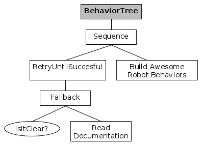

# Home

## About this library

This  __C++__ library provides a framework to create BehaviorTrees.
It was designed to be flexible, easy to use and fast.

Even if our main use-case is __robotics__, you can use this library to build
__AI for games__, or to replace Finite State Machines in you application.

__BehaviorTree.CPP__ has many interesting features, when compared to other implementations:

- It makes asynchronous Actions, i.e. non-blocking, a first-class citizen.
- It allows the creation of trees at run-time, using a textual representation (XML).
- You can link staticaly you custom TreeNodes or convert them into plugins 
which are loaded at run-time.
- It includes a __logging/profiling__ infrastructure that allows the user 
to visualize, record, replay and analyze state transitions.

  

## The problem

Many software systems, being robotics a notable example, are inherently
complex.

The usual approach to manage complexity, heterogeneity and scalability is to 
use the concept of 
[Component Base Software Engineering](https://en.wikipedia.org/wiki/Component-based_software_engineering).

Any existing middleware for robotics took this approach either informally or formally,
being [ROS](www.ros.org), [YARP](www.yarp.it) and 
[SmartSoft](http://www.servicerobotik-ulm.de) some notable examples.

A "good" software architecture should have the following characteristics:

- Modularity.
- Reusability of components.
- Composability.
- Good separation of concerns. 

If we don't keep these concepts in mind from the very beginning, we create 
software modules/components which are highly coupled to a particular application,
instead of being reusable.

Frequently, the concern of __Coordination__ is mixed with __Computation__. 
In other words, people address the problems of coordinating actions and take decisions
locally.

The business logic becomes "spread" in many locations and it is __hard for the developer
to reason about it and to debug errors__ in the control flow.

To achieve strong separation of concerns it is better to centralize
the business logic in a single location. 

__Finite State Machines__ were created specifically with this goal in mind, but in
the recent years __Behavior Trees__ gained popularity, especially in the game industry.

## What is a Behavior Tree?

A Behavior Tree (__BT__) is a way to structure the switching between different 
tasks in an autonomous agent, such as a robot or a virtual entity in a computer game.

BTs are a very efficient way of creating complex systems that are both modular and reactive. 
These properties are crucial in many applications, which has led to the spread 
of BT from computer game programming to many branches of AI and Robotics. 
 
If you are already familiar with Finite State Machines (__FSM__), you will
easily grasp most of the concepts but, hopefully, you will  find that BTs
are more expressive and easier to reason about.

The main advantages of Behavior Trees, when compared to FSMs are:

- __They are intrinsically Hierarchical__: this means that we can _compose_
complex behaviors including entire trees as sub-branches of a bigger tree. 
For instance, the behavior "Fetch Beer" may reuse in one of its nodes the tree
"Grasp Object".

- __Their graphical representation has a semantic meaning__: it is easier to 
"read" a BT and understand the corresponding workflow. 
State transitions in FSMs, by comparisons, are harder to understand
both in their textual and graphical representation.    

- __They are more expressive__: Ready to use ControlNodes and DecoratorNodes
make possible to express more complex control flows. The user can extend the
"vocabulary" with his/her own custom nodes.

