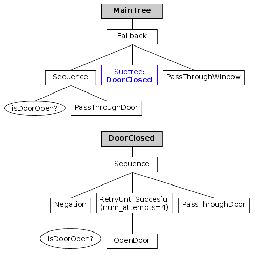

One of the main advantages of Behavior Trees is that they are __intrinsically
hierarchical__.

You might have noticed that it is always possible to raise the level of
abstraction looking one node up in the hierarchy of the tree.

For example, in the [Introduction](BT_basics.md) page we have seen this tree:

  

The Sequence calle "Unlock" can be seen as an entire subtree with an arbitrary
level of complexity.

BehaviorTree.CPP provides a way to create reusable and composable Subtrees
that can be included as nodes of a larger and more complex tree.

## Example: subtrees in XML

To use the Subtree funtionality, you __don't__ need to modify your
__cpp__ code, nor your existing TreeNodes.

Multiple BehaviorTrees can be created and composed in the XML itself.


``` XML hl_lines="21"
<root main_tree_to_execute = "MainTree">
	<!--------------------------------------->
    <BehaviorTree ID="DoorClosed">
        <Sequence name="door_closed_sequence">
            <Negation>
                <IsDoorOpen/>
            </Negation>
            <RetryUntilSuccesful num_attempts="4">
                <OpenDoor/>
            </RetryUntilSuccesful>
            <PassThroughDoor/>
        </Sequence>
    </BehaviorTree>
    <!--------------------------------------->
    <BehaviorTree ID="MainTree">
        <Fallback name="root_Fallback">
            <Sequence name="door_open_sequence">
                <IsDoorOpen/>
                <PassThroughDoor/>
            </Sequence>
            <SubTree ID="DoorClosed"/>
            <PassThroughWindow/>
        </Fallback>
    </BehaviorTree>
    <!---------------------------------------> 
</root>
```

The corresponding graphical representation is:

 

